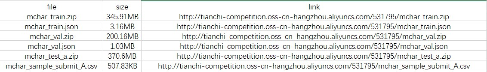
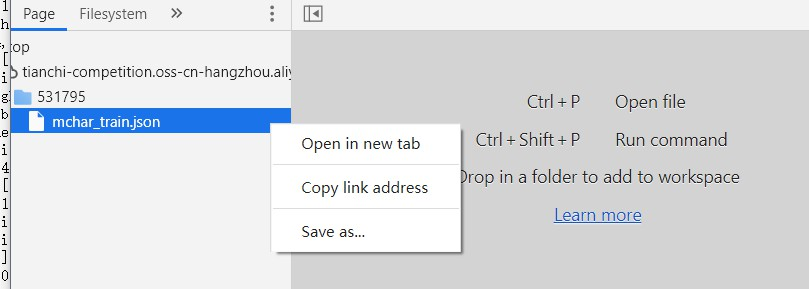
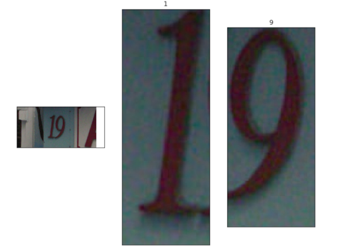

# Task 1 赛题理解

## 赛题背景
对谷歌街景门牌号数据集（SVHN）中的字符进行识别，属于典型的字符识别问题。类似背景有手写数字识别、手写文字识别等。难度较低，便于从基础开始CV的学习。

## 赛题数据集下载

打开下图中的link，即可完成数据集下载



注：在Chrome浏览器中打开json链接会直接打开文件，因此首先需要通过 **F12** 打开 **DevTools** ，然后在Source中找到对应的json文件，Save即可



## 数据读取

运行提供的Code，采用提供的Code进行数据读取

```python
import json
train_json = json.load(open('../input/train.json'))

# 数据标注处理
def parse_json(d):
    arr = np.array([
        d['top'], d['height'], d['left'],  d['width'], d['label']
    ])
    arr = arr.astype(int)
    return arr

img = cv2.imread('../input/train/000000.png')
arr = parse_json(train_json['000000.png'])

plt.figure(figsize=(10, 10))
plt.subplot(1, arr.shape[1]+1, 1)
plt.imshow(img)
plt.xticks([]); plt.yticks([])

for idx in range(arr.shape[1]):
    plt.subplot(1, arr.shape[1]+1, idx+2)
    plt.imshow(img[arr[0, idx]:arr[0, idx]+arr[1, idx],arr[2, idx]:arr[2, idx]+arr[3, idx]])
    plt.title(arr[4, idx])
    plt.xticks([]); plt.yticks([])
``` 

读取结果如下图所示：



## 初步思路

本次赛题主要任务是完成字符识别，属于目标检测范围。因此初步思路可以考虑通过 **Faster-RCNN** 或 **YOLO** 完成该任务，可结合Baseline中给出的 **ResNet-18** 模型的训练结果，对初次结果进行评估对比，再去查阅资料进行网络模型优化。考虑到PyTorch在模型设计中的快捷性，个人感觉可以通过此次机会独立完成一个简易模型的设计，达到锻炼的目的。

