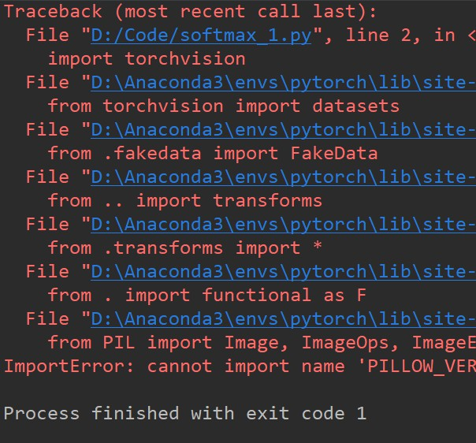
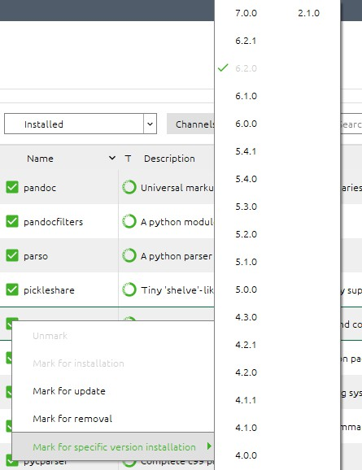
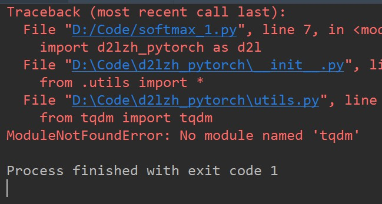

### 1.Pillow ERROR

- **`cannot import name 'PILLOW_VERSION'`**



- 即使安装了**pillow**,也会在运行时报出上述错误，原因在于，目前的**pillow** 版本为 **7.0.0**，不存在 **_VERSION** 函数或方法，降低版本到 **6.2.0** 即可。


---
### 2.未安装 tqdm

- Anaconda安装即可

---
### 3.TorchText ERROR
- GitHub地址安装
```
pip install https://github.com/pytorch/text/archive/master.zip
```

该方法无法安装成功，目前
`https://github.com/pytorch/text/archive`
地址已失效。

- Pytorch官方Git上提出Python 2.7 或 3.5+ 以及PyTorch 0.4.0以上版本用户
```
pip install torchtext
```
该方法失败，Error如下
```
ERROR: Could not find a version that satisfies the requirement urllib3!=1.25.0,!=1.25.1,<1.26,>=1.21.1 (from requests->torchtext) (from versions: none)
ERROR: No matching distribution found for urllib3!=1.25.0,!=1.25.1,<1.26,>=1.21.1 (from requests->torchtext)
```

- Git手动下载TorchText库安装
 - 打开Anaconda Prompt
 **`activate pytorch`**
 切换虚拟环境
 ```
 pip install D:\Lab\text-master.zip
 ```
出现 **<code>Read timed out</code>** 错误

 - 修改命令，设置超时时间,安装成功
 ```
pip --default-timeout=100 install "D:\Lab\text-master (1).zip"
```
