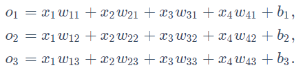

- ### 区别
  - **线性回归模型：** 用于输出连续值的场景
  - **SoftMax回归模型：** 用于分类场景的离散值预测，输出值个数等于标签类别数
---
### 1.SoftMax模型
1. 对于一个拥有4种特征3种输出的动物类别，共有12种权重作为标量（w)，以及3个偏差标量（b)

2. 随后用**SoftMax( )** 函数将输出值换为值为正，且和为1的概率分布
**$\hat{y}$1, $\hat{y}$2, $\hat{y}$3 = softmax(O1, O2, O3)**
> $$\hat{y}_i = \frac{\exp(o_i)}{\sum_{i=1}^3\exp(o_i)}$$
注：$\exp(x)$表示**e**的**x**次方

3. 单样本分类的矢量计算表达式

> $$O^i = x^i W+b$$
> $$\hat{y}^i = softmax(o^i)$$

---
### 2.交叉熵损失函数
- 平方损失估计

$$Loss = |\hat{y}^{(i)} - y^{(i)}|^2 / 2$$
过于严格
- 交叉熵损失函数 **[Cross Entropy]**

$$H(y^{(i)}, \hat{y}^{(i)}) = -\sum_{j=1}^q y^{(i)}_jlog \hat{y}^{(i)}_j$$
其中$y^{(i)}_j$是指只有第$i$个元素为1，其余为0的一个数组，故上式也可化简为：

$$H(y^{(i)}, \hat{y}^{(i)}) = -log\hat{y}_{y^{(i)}}^{(i)}$$
也就是说，交叉熵只关心对正确类别的预测概率，因为只要其值足够大，就可以确保分类结果正确。但遇到一个样本有多个标签，例如图像里含有不止一个物体时，不能做这一步简化。
当训练样本为$n$时，交叉熵损失函数定义为：

$$ ℓ(Θ) = \frac {1}{n} \sum_{i=1}^nH(y^{(i)}, \hat{y}^{(i)})$$
其中$Θ$代表模型参数，当每个物体只有一个标签时，可化简为

$$ ℓ(Θ) = -\frac {1}{n} \sum_{i=1}^nlog\hat{y}_{y^{(i)}}^{(i)}$$

---
### 3.模型预测与评价
在训练好softmax回归模型后，给定任一样本特征，就可以预测每个输出类别的概率。通常把预测概率最大的类别作为输出类别。如果它与真实类别（标签）一致，说明这次预测是正确的。