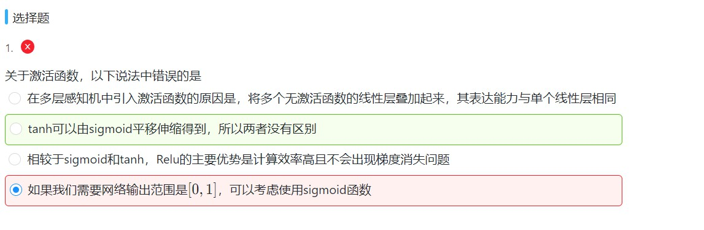

# 多层感知机
### 1. 隐藏层
- 在输入层与输出层之间引入一至多个隐藏层构成多层感知机的神经网络图，隐藏层与输出层为全连接层。
 - 小批量样本：$X \in \mathbb{R}^{n \times d}$,批量大小为$n$,输入个数为$d$。
 - 单个隐藏层：$H \in \mathbb{R}^{n \times h}$,批量大小为$n$,隐藏单元个数为$h$。
 - 隐藏层权重参数与偏差参数：$W_h \in \mathbb{R}^{d \times h}$，$b_h \in \mathbb{R}^{1 \times h}$
 - 输出层权重参数与偏差参数：$W_o \in \mathbb{R}^{h \times q}$，$b_o \in \mathbb{R}^{1 \times q}$，$q$为输出个数

 故单隐藏层感知机的输出$O \in \mathbb{R}^{n \times q}$为

 $$H = XW_h + b_h$$

 即隐藏层的输出为输出层的输入

对于含单隐藏层的多层感知机

$$H = XW_h + b_h$$
$$O = HW_o + b_o$$
联立后为

$$O = XW_hW_o + b_hW_o + b_o$$

即 $O = XW + b$，所以即使添加再多隐藏层，仍可看作一个单层神经网络。
输出层和隐藏层均为全连接的线性层，无限叠加后，仍为一个单层的线性层。故可以添加一个非线性的变换解决该问题。

> 对隐藏层的输出使用按元素运算的非线性函数进行变换，然后再作为下一个全连接层的输入。这个非线性函数被称为激活函数

---

### 2.激活函数
- **ReLU函数**


 $$ReLU(x) = max(x,0)$$
 - ReLU函数的导数
 输入小于0时，导数值为0，输入大于0时，导数值为1
 
 
 ---
 
- **sigmoid函数**


$$sigmoid(x) = \frac {1}{1 + \exp(-x)}$$
 - sigmoid函数的导数
 当输入为0时，sigmoid函数的导数达到最大值0.25；当输入越偏离0时，sigmoid函数的导数越接近0。
 

 $$sigmoid′(x)=sigmoid(x)(1−sigmoid(x))$$

 ---
 
- **tanh函数**


$$tanh(x) = \frac {1 - \exp(-2x)}{1 + \exp(-2x)} =  \frac {2}{1 + \exp(-2x)} - 1$$

前一部分$\frac {2}{1 + \exp(-2x)}$的范围是[0,2]，减1后，即$tanh(x)$的范围为[-1,1]。

 - tanh函数的导数
 当输入为0时，tanh函数的导数达到最大值1；当输入越偏离0时，tanh函数的导数越接近0。
 

 $$tanh′(x)=1−tanh^2(x)$$
 
---
 
### 3.激活函数的选择
- ReLU是一个通用激活函数，适用于绝大多数情况，但只能在隐藏层中使用
- 用于分类器时，Sigmoid函数效果更好，但由于sigmoid和tanh函数有时会把元素变换到[0,1]和[-1,1]之间，容易出现梯度消失问题，故有时要避免使用Sigmoid与tanh函数
- 在神经网络层数较多时，尽量使用ReLU函数，有助于减小计算量，tanh和sigmoid函数计算量大
- 在选择激活函数时，可以先选择ReLU函数，如果效果不好，可以再尝试别的激活函数。

---

### 4.多层感知机
多层感知机的输出：

$$H = \phi(XW_h + b_h)$$
$$O = HW_o + b_o$$
其中$\phi$表示激活函数
- 多层感知机在输入层与输出层之间加入了一个或多个全连接隐藏层，通过激活函数对隐藏层的输出进行变换。

- 在分类问题中，我们可以对输出$O$做softmax运算，并使用softmax回归中的交叉熵损失函数。

- 在回归问题中，我们将输出层的输出个数设为1，并将输出$O$直接提供给线性回归中使用的平方损失函数。

---

### 5.多层感知机的实现
- 处理参数
  - 从零自定义实现
 ```
 W1 = torch.tensor(np.random.normal(0, 0.01, (num_inputs, num_hiddens)), dtype=torch.float)
b1 = torch.zeros(num_hiddens, dtype=torch.float)
W2 = torch.tensor(np.random.normal(0, 0.01, (num_hiddens, num_outputs)), dtype=torch.float)
b2 = torch.zeros(num_outputs, dtype=torch.float)
 ```
 **`W1`** 为输入层 **`num_inputs`** 和隐含层 **`num_hiddens`** 的权重参数
 **`W2`** 为输出层 **`num_outputs`** 和隐含层 **`num_hiddens`** 的权重参数
 后续将以上参数传入自定义 **`ReLU`** 函数处理
- 模型定义
 ```
 def net(X):
    X = X.view((-1, num_inputs))
    H = relu(torch.matmul(X, W1) + b1)
    return torch.matmul(H, W2) + b2
 ```
 **matmul( )函数：用于计算矩阵相乘**

 - 通过 **``Pytorch``** 中的 **`nn.Sequential`** 模块实现
   &ensp;&ensp;&ensp;&ensp; **`Sequential`** 模块是一个有序容器，神经网络模块将按照在传入构造器的顺序依次被添加到计算图中执行
  ```
  net = nn.Sequential(
        d2l.FlattenLayer(),
        nn.Linear(num_inputs, num_hiddens),
        nn.ReLU(),
        nn.Linear(num_hiddens, num_outputs),
)
```
 &ensp;&ensp;&ensp;&ensp;在该模块中先对输入层 **`num_inputs`** 和隐含层 **`num_hiddens`** 进行一次 **`Linear`** 线性运算，然后通过 **`PyTorch`** 自带的 **`ReLU`** 函数处理该值，最后再对输出层 **`num_outputs`** 和隐含层 **`num_hiddens`** 进行 **`Linear`** 线性运算，得到输出值 $O$
 
---

### 6.错题
