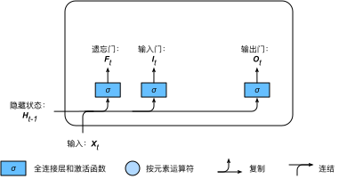

# 循环神经网络
 - 不含隐藏状态的 **神经网络**
 - 含有隐藏状态的 **循环神经网络**
## 不含隐藏状态的神经网络
即一个含单隐藏层的多层感知机，给定样本数为$n$，输入个数（特征数或特征向量维度）为$d$的小批量数据样本$X \in \mathbb{R}^{n \times d}$，设隐藏层隐藏单元个数为$h$，则隐藏层的输出$H \in \mathbb{R}^{n \times h}$

$$H = \phi(XW_{xh} + b_h)$$
隐藏层权重参数$W_{xh} \in \mathbb{R}^{d \times h}$，偏差参数$b_{h} \in \mathbb{R}^{1 \times h}$，设$H$为输出层输入，$q$为输出个数，输出层的输出$O \in \mathbb{R}^{n \times q}$

$$O = HW_{hq} + b_q$$
输出层权重参数$W_{hq} \in \mathbb{R}^{h \times q}$，偏差参数$b_{q} \in \mathbb{R}^{1 \times q}$

## 含隐藏状态的循环神经网络
对上述多层感知机添加隐藏状态，使之成为循环神经网络

当输入数据存在时间相关性时，序列中时间步$t$的小批量输入$X_t \in \mathbb{R}^{n \times d}$，隐藏变量$H_t \in \mathbb{R}^{n \times h}$。此时保存上一时间步的隐藏变量$H_{t-1} \in \mathbb{R}^{n \times h}$，并引入新的权重参数$W_{hh} \in \mathbb{R}^{h \times h}$用来描述在当前时间步如何使用上一时间步的隐藏变量。

即时间步$t$的隐藏变量由当前时间步的输入和上一时间步的隐藏变量共同决定。

$$H_t = \phi(X_tW_{xh} + H_{t-1}W_{hh} + b_h)$$
此时隐藏变量可以捕捉截至当前时间步的序列历史信息，也被称为隐藏状态。

又因为隐藏状态在当前时间步的定义使用了上一时间步的隐藏状态，上式的计算是循环的，故被称为含隐藏状态的循环神经网络。

此时在时间步$t$，输出层的输出为

$$O_t = H_tW_{hq} + b_q$$
并且需要注意的是，循环神经网络模型参数的数量不随时间步的增加而增长。

由上图可得，隐藏状态中，$X_tW_{xh} + H_{t-1}W_{hh}$等价于$X_t$先与$H_{t-1}$拼接后的矩阵乘以$W_{xh}$与$W_{hh}$拼接后的矩阵。即

$$X_tW_{xh} + H_{t-1}W_{hh} = 
\left[\begin{matrix}
    X_t & H_{t-1}
    \end{matrix}\right] \times 
    \left[\begin{matrix}
    W_{xh} \\ W_{hh}
    \end{matrix}\right]
$$

# 通过时间反向传播 --BPTT算法
在循环神经网络中，梯度通过时间反向传播进行计算和存储，该方法是反向传播的具体应用。

需要将循环神经网络按时间步展开，得到模型变量与参数间的依赖关系，并依据链式法则应用反向传播计算并存储梯度。

## 定义模型
假设神经网络无偏差项，隐藏状态$h_t \in \mathbb{R}^h$为

$$h_t = W_{hx}x_t + W_{hh}h_{t-1}$$
时间步$t$的输出层变量$o_t$为

$$o_t = W_{qh}h_t$$
设时间步$t$的损失函数为$\ell(o_t,y_t)$。时间步数为T的损失函数L为

$$L = \frac{1}{T} \sum^{T}_{t=1}\ell(o_t,y_t)$$
$L$ 为有关给定时间步的数据样本的目标函数。

## 计算图

其中时间步3的隐藏状态$h3$的计算依赖模型参数$W_{hx}$、$W_{hh}$、上一时间步的隐藏状态$h_2$以及当前输入$x_3$。

## 实现方法
上图模型的参数为$W_{hx},W_{hh},W_{qh}$,其梯度分别为

$$\frac {\partial L}{\partial W_{hx}}，\frac {\partial L}{\partial W_{hh}}，\frac {\partial L}{\partial W_{qh}}$$
根据图中依赖关系，按照箭头反方向进行梯度的计算和存储。

**prod** 运算符是指根据两个输入的形状，在必要的操作（例如转置、互换输入位置）后对两个输入做乘法运算。

首先是目标函数有关各时间步输出层的梯度

$$\frac {\partial L}{\partial o_{t}} = \frac{\ell(o_t,y_t)}{T·\partial o_{t}}$$
因为$L$通过$o_1,o_2,...,o_T$依赖$W_{qh}$,故

又因为隐藏关系之间也存在以来关系，根据链式法则可得

由上述指数可得，当时间步数 *T* 较大或者时间步 *t* 较小时，目标函数有关隐藏状态的梯度很容易发生 **梯度爆炸** 或 **梯度消失**。

又因为$L$通过 $h_1,h_2,...h_T$依赖参数$W_{hx},W_{hh}$。所以${\partial L} / {\partial h_{t}}$的爆炸或消失很容易影响这些参数。

在每次迭代过程中，依次计算完上述梯度后，会将其存储起来，避免重复计算。

参数梯度如 $\frac {\partial L}{\partial W_{hh}}$ 中的计算需要依赖隐藏状态在时间步$t = 0,...,T-1$的当前值$h_t$。而该值是通过从输入层到输出层的正向传播计算并存储获得的。

所以在训练深度学习模型时，正向传播与反向传播 **相互依赖**。

# 门控循环神经网络（GRNN）
- 通过可学习的门控制信息的流动，捕捉时间序列中时间步较大的依赖关系
- 门控循环单元（GRU）是一种常用的门控循环神经网络
## 门控循环单元的设计
### 重置门与更新门

重置门与更新门的输出通过激活函数$sigmoid$得到

$$R_t = \sigma(X_tW_{xr} + H_{t-1}W_{hr} + b_r$$

$$Z_t = \sigma(X_tW_{xz} + H_{t-1}W_{hz} + b_z$$
因为$sigmoid$函数将元素值变换到 [0,1] 之间，故$R_t,Z_t$的值域均为[0,1]。

### 候选隐藏状态
门控循环单元通过计算候选隐藏状态来辅助隐藏状态的计算

 - 点积$\odot$：按元素相乘

重置门中元素值接近0时，舍弃上一步的隐藏状态。元素值接近1时，保留上一时间步的隐藏状态

$$\tilde{H_t} = tanh(X_tW_{xh}+(R_t \odot H_{t-1})W_{hh}+b_h)$$

重置门控制上一时间步的隐藏状态流入当前时间步的候选隐藏状态，因为上一时间步的隐藏状态包含时间序列截至上一时间步的全部历史信息，因此重置门可用来丢弃与预测无关历史信息。

### 隐藏状态

$$H_t = Z_t \odot H_{t-1}+(1-Z_t) \odot \tilde{H_t}$$
假设更新门在时间步$t^{’}$到$t$之间一直近似1，则在该时间段之间的输入信息几乎没有流入时间步$t$的隐藏状态$H_t$。使得较早时刻的隐藏状态$H^{’}_{t-1}$可以一直通过时间保存并传递到当前时间步$t$。从而有效捕捉时间序列中时间步距离较大的依赖关系，减小 **梯度衰减** 问题。

**总结：**
- 重置门有助于捕捉时间序列里短期的依赖关系
- 更新门有助于捕捉时间序列里长期的依赖关系

# 长短期记忆（LSTM）
- 输入门
- 遗忘门
- 输出门
- 记忆细胞（与隐藏状态形状相同，可看作特殊的隐藏状态）

## 输入、输出和遗忘门

时间步$t$的输入门$I_t$、遗忘门$F_t$、输出门$O_t$的计算如下：

$$I_t = \sigma(X_tW_{xi}+H_{t-1}W_{hi}+b_i)$$

$$F_t = \sigma(X_tW_{xf}+H_{t-1}W_{hf}+b_f)$$

$$O_t = \sigma(X_tW_{xo}+H_{t-1}W_{ho}+b_o)$$
因为三个门的输出由$sigmoid$函数计算获得，因此值域均为[0,1]。

## 候选记忆细胞

使用值域在[-1,1]的$tanh$函数作为激活函数，候选记忆细胞$\tilde{C_t}$的计算为：

$$\tilde{C_t} = tanh(X_tW_{xc}+H_{t-1}W_{hc}+b_c$$

## 记忆细胞
通过元素点积($\odot$)来实现控制隐藏状态中信息的流动。

当前的时间步记忆细胞$C_t$的计算组合了上一时间步记忆细胞和当前时间步候选记忆细胞的信息，通过遗忘门和输出门控制信息流动：

$$C_t = F_t \odot C_{t-1}+I_t \odot \tilde{C_t}$$

- 遗忘门$F_t$：控制上一时间步的记忆细胞$C_{t-1}$中的信息能否传到当前时间步

- 输入门$I_t$：控制当前时间步的输入$X_t$通过候选记忆细胞\tilde{C_t}如何流入当前时间步的记忆细胞。

故当遗忘门一直近似1，而输出门一直近似0，过去的记忆细胞将一直通过时间保存并传递至当前时间步。从而有效应对循环神经网络的梯度衰减问题，更好地捕捉时间序列中时间步距离较大的依赖关系。

## 隐藏状态
可以通过输出门控制从记忆细胞到隐藏状态$H_t$的信息流动

$$C_t = F_t \odot C_{t-1}+I_t \odot \tilde{C_t}$$

$$H_t = O_t \odot tanh(C_t)$$

当输出门近似1时，记忆细胞信息将传递至隐藏状态，供输出层使用；当输出门近似0时，记忆细胞信息将自己保留。
