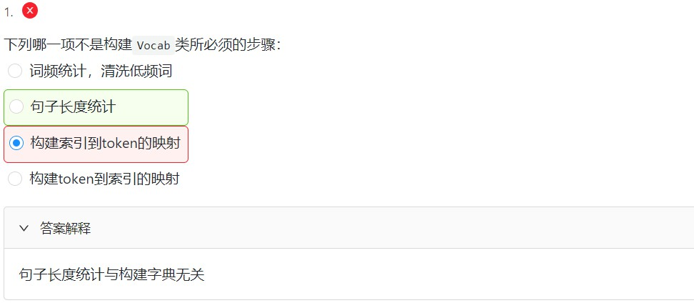
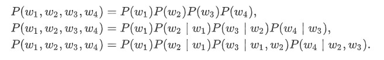
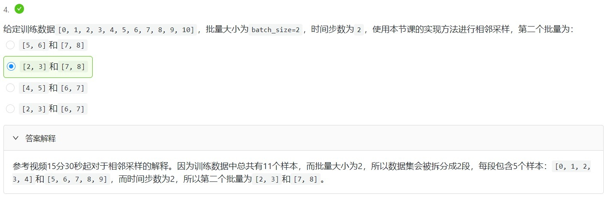

## 1. 文本预处理 -Time Machine
### 1.1 简单预处理步骤
 - 读入文本
 - 分词
 - 建立字典，将每个词映射到唯一的文本
 - 将文本从词的序列转换为索引的序列，方便输入模型

### 1.2 读入文本
- 读入本地TXT文件: `D:/XXXX/timemachine.txt`，若换为`\`，则会产生Error。
- **gbk** Error
> 'gbk' codec can't decode byte 0x9d in position 2063: illegal multibyte sequence

 - 解决方法：- `open("D:/cloudFile/timemachine.txt", 'r')` 换为 `open("D:/cloudFile/timemachine.txt", 'r', encoding='UTF-8')`

- **`line.strip().lower()`**
  - **strip( )函数** - 用于去掉文本前缀后缀中的空白字符，如制表符、空格等
  - **lower( )函数** - 将大写字符转换为小写
  - **re.sub( )函数** - 用于替换字符中的匹配项
 
```
lines = [re.sub('[^a-z]+', ' ', line.strip().lower()) for line in f]
# 将文件每一行的前后缀空白字符去掉，大写字母换为小写，
# 然后把由非小写英文字符构成的子串替换为空格，得到lines列表，列表元素就是文件每一行处理后得到的结果。
```


---
### 1.3 分词
 - **tokenize(sentences, token='word')**
   - sentences是一个列表，每个列表元素是一个字符串或句子
   - token是一个标志，用来表示做哪个级别的分词

    |  word | char  |
    | ------------ | ------------ |
    | 单词级别  | 字符级别  |
函数返回一个二维列表，第一个维度是sentence中的每个句子，第二个维度则是每个句子分词后得到的每个单词或字符序列

---
### 1.4 建立字典
为了方便模型处理，我们需要将字符串转换为数字。因此我们需要先构建一个字典（vocabulary），将每个词映射到一个唯一的索引编号。
- **Vocab(object)** 函数
  - 输入单词可查询对应的索引，反之也可。

- 构造函数
```
def __init__(self, tokens, min_freq=0, use_special_tokens=False)
```
- 参数定义
  - **`token`** 指分词后返回的二维列表
  - **`min_freq`** 为阈值，可以忽略掉出现次数低于该值的词
  - **`use_special_tokens`** 是一个标志，用来表示构造函数时是否使用特殊的token
- 特殊token
  - pad：训练结果为一个batch，batch中各句子可能会不一样长，就需要用若干`pad`将短句补长到最长句子的长度
  - bos/eos：在句子开头和结尾处添加的特殊token，用来表示句子的开始和结束
  - unk：有时输入的词是语料库中未出现的词，此时就把这些词当作`unk`处理
 
- enumerate函数
  - 将一个可遍历的数据对象(如列表、元组或字符串)组合为一个索引序列，同时列出数据和数据下标
 
- 错题



---
### 1.5 用现有工具进行分词
- 原方法具有以下缺点：
  - 标点符号通常可以提供语义信息，但是我们的方法直接将其丢弃了
  - 类似“shouldn't", "doesn't"这样的词会被错误地处理
  - 类似"Mr.", "Dr."这样的词会被错误地处理
  
- spaCy分词
  - 通过`spacy.load( )`导入language
  > nlp = spacy.load('en')
  - 定义后的nlp可以直接作用于文本
  > doc = nlp(text)
- NLTK分词
  - 通过`word_tokenize(text)`对文本进行分词
 ```
 from nltk.tokenize import word_tokenize
 text = "Mr. Chen doesn't agree with my suggestion."
 print(word_tokenize(text))
 # ['Mr.', 'Chen', 'does', "n't", 'agree', 'with', 'my', 'suggestion', '.']
 ```

---
## 2. 语言模型
- 给定一个长度为$T$的词的序列$w_1,w_2,...,w_T$，语言模型的目标是计算该序列的概率：

$$P(w_1,w_2,...,w_T)$$
来判断该序列的合理性，概率值越大越合理
- 假设序列$w_1,w_2,...,w_T$中的每个词是依次生成的，则有

$$P(w_1,w_2,...,w_T) = \prod^{T}_{t=1}P(w_T|w_1,...,w_{T-1}) = P(w_1)P(w_2|w_1)...P(w_T|w_1,...,w_{T-1})$$
语言模型的参数就是词的概率以及给定前几个词情况下的条件概率。设训练数据集为一个大型文本语料库，如维基百科的所有条目，词的概率可以通过该词在训练数据集中的相对词频来计算

$$\hat{P}(w_i) = \frac{n(w_i)}{n}$$
$n(w_1)$为语料库中以$w_1$为第一个词的文本的数量
给定$w_1$情况下，$w_2$的条件概率可以计算为：

$$\hat{P}(w_2|w_1) = \frac{n(w_1,w_2)}{n(w_1)}$$
$n(w_1,w_2)$为语料库中以$w_1$为第一个词，$w_2$作为第二个词的文本的数量。

### 2.1 $n$元语法
- $n$元语法是基于统计的语言模型，通过马尔可夫假设简化模型
- **马尔科夫假设**：指一个词的出现只与前面$n$个词相关，即$n$阶马尔可夫链
  - 如果$n = 1$，则$P(w_3|w_1,w_2) = P(w_3|w_2)$
  - 所以基于$n-1$阶马尔可夫链，可改为

  $$P(w_1,w_2,...,w_T) = \prod^{T}_{t=1}P(w_t|w_{t-(n-1)},...,w_{t-1})$$这就是$n$元语法
  - 当$n = 1，2，3$时，我们将其分别称作一元语法（unigram）、二元语法（bigram）和三元语法（trigram，长度为4的序列$w_1,w_2,w_3,w_4$在一元语法、二元语法和三元语法中的概率分别为:

- $n$元语法的缺陷
  - $n$较小时，$n$元语法往往不准确
  - 当$n$较大时，$n$元语法需要计算并存储大量的词频和多词相邻频率，产生较大计算与存储开销
  - 参数空间过大：$P(w_1)P(w_2|w_1)P(w_3|w_1,w_2)$的空间为$V + V^2 + V^3$
  - 数据稀疏：根据齐夫定律，在一个语料库中，单词的词频与单词词频的排名成反比，这证明大部分单词的词频很小，导致参数输出为0，数据稀疏严重。

---
### 2.2 时序数据的采样
时序数据的一个样本通常包含连续的字符，如果序列的长度为$T$，时间步数为$n$，那么一共有$T-n$个合法的样本，但是这些样本有大量的重合，我们通常采用更加高效的采样方式。我们有两种方式对时序数据进行采样，分别是随机采样和相邻采样。
 - 随机采样
   - 给定一定序列作为训练数据，同时给定一定批量大小`batch_size`与时间步数`num_steps`。将序列划分为若干长度等于时间步数的分组，最后如剩下一段长度不足时间步数的序列则忽略掉。每个分组就是一个样本，每次在分组中取`batch_size`个作为批量。每个分组选择一次，直到最后剩余分组不足`batch_size`个。
 - 相邻采样
   - 各个`batch`在训练数据上是连续的。假设批量大小为$n$，将一个序列$n$等分，每个`batch`在每个序列的相同位置。
  