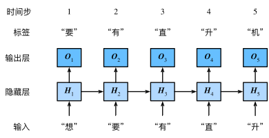
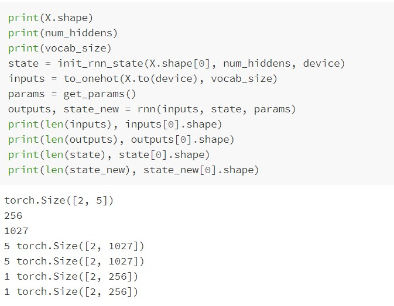

## 1. 神经网络基础
### 1.1 基于循环神经网络实现语言模型
- **目标**：可以在任意时刻，根据当前与过去的输入序列，实现对序列下一个字符的预测
- $H_t$表示循环网络的隐藏变量$H$在时间$t$的值，$H_t$的计算基于$X_t$和$H_{t-1}$

---
#### 循环神经网络的具体构造

$$H_t = \phi(X_tW_{xh} + H_{t-1}W_{hh} + b_h) $$相加结果是一个$n \times h$的矩阵
输出层的输出为：

$$O_t = H_tW_{hq} + b_q$$
其中$h$为向量长度

---

#### 从零实现循环神经网络
- **one-hot**向量

    用于将字符表示成向量。假设词典大小为$N$，每次字符对应一个从$0$到$N-1$的唯一索引，则该字符的向量是一个长度为$N$的向量，若字符的索引是$i$，则该向量的第$i$个位置为$1$，其他位置为$0$。

- 在初始化模型参数时，隐藏单元个数`num_hiddens`为超参数

- `one_hot(x, n_class, dtype=torch.float32)`
    - `x` 是一个一维向量，每个元素是一个字符的索引
    - `n_class` 为字典的大小
    - `dtype` 指定返回类型

 - `to_onehot(X, n_class)`
 
   将采样的小批量形状 **[批量大小,时间步数]** 变换为数个形状为 **[批量大小,词典大小]** 的矩阵，矩阵个数等于时间步数。即时间步$t$的输入$X_t \in \mathbb{R}^{n \times b}$，其中$n$为批量大小，$d$为词向量大小 **[one-hot向量长度]**，也就是词典大小。
 
 - 定义模型 `rnn(inputs, state, params)`
   - `inputs`与`outputs`皆为长度为`num_steps`的列表，列表的每个元素为(batch_size, vocab_size)的矩阵
   - `state`提供函数在维护时状态的初始值
   - `params`为模型的参数$W和b$
   - 返回值为`outputs`与新状态`(H,)`

> 因为后续可能通过相邻采样进行采集数据，此时当前`batch`的状态`(H,)`就可以作为下一个`batch`的初始值。

 - 初始化参数 `init_rnn_state( )`

    参数`device`用于控制使用设备为CPU 还是 GPU

---
#### 裁剪梯度
 
因为循环神经网络通过时间进行反向传播，模型参数的指数是时间步数，故随着时间步数的增多，很容易出现梯度衰减或梯度爆炸，一般通过裁剪梯度来应对梯度爆炸把所有模型参数的梯度拼接成一个向量 $g$，并设裁剪的阈值是$θ$。裁剪后的梯度

$$min(\frac {θ}{||g||},1)g$$
其$L_2$范数不能超过$θ$。

$L_2$范数即欧氏距离：

$$||x||=\sqrt{\sum_{i=1}^{n}x^2_i}$$
- `grad_clipping(params, theta, device)`
  - `params`为模型的所有参数
  - `theta`为预设的阈值

**注意：梯度裁剪只能应用于梯度爆炸，不能用于梯度消失**

---
#### 定义预测函数
 > predict_rnn(prefix, num_chars, rnn, params, init_rnn_state,num_hiddens, vocab_size, device, idx_to_char, char_to_idx)
 
 基于前缀`prefix`(含有数个字符的字符串)来预测接下来的`num_chars`个字符

---
#### 困惑度
 常用来评价模型的好坏，即标签类别预测概率的倒数
- 最佳情况下，模型总是把标签类别的概率预测为1，此时困惑度为1；
- 最坏情况下，模型总是把标签类别的概率预测为0，此时困惑度为正无穷；
- 基线情况下，模型总是预测所有类别的概率都相同，此时困惑度为类别个数。

---
#### 模型训练函数
 如果使用相邻采样，就需要在每个`epoch`开始时初始化隐藏状态，但也会导致在训练过程中，同类`epoch`随着batch的增大，损失函数关于隐藏变量的梯度传播的更远，计算开销也会更大。所以为了减少开销，会在`batch`开始时，把隐藏状态从计算图中分离出来。

---
#### 简洁实现循环神经网络
使用PyTorch中`nn.RNN`来构造循环神经网络

 - 构造函数参数
   - `input_size` - 输入单元个数（整型）
   - `hidden_size` - 隐藏单元个数（整型）
   - `nonlinearity` - 控制需要哪种非线性激活函数，类型是字符串，可以是$tanh$，也可以是$ReLU$，默认$tanh$
   - `batch_first` - 布尔类型参数，用来控制模型输入输出的形状。
        - 如果为真，形状为 (batch_size, num_steps, input_size)。
        - 如果为假，形状为 (num_steps, batch_size, input_size)。
        - 默认参数为`False`
 
 - $forward( )$函数相当于从零实现里的$RNN( )$函数，主要负责循环神经网络的前向计算。
    - `input`和`h_0`与$RNN( )$里面的`input`和`state`基本相同
    - `input`是一个形状为`(num_steps, batch_size, input_size)`的三元`tensor`
    - `h_0`是一个形状为`(num_layers * num_directions, batch_size, hidden_size)`三元`tensor`
    - `num_layers`与深度循环网络有关，`num_directions`与双向循环网络有关，在这里二者均为1。
    - 若`h_0`未被提供，则当作0处理
 
 - $forward( )$函数的返回值`output`是各个时间步隐藏状态的值
    - `output`形状`(num_steps, batch_size, num_directions * hidden_size)`
    - `h_n`返回最后一个时间步隐藏状态的值，形状`(num_layers * num_directions, batch_size, hidden_size)`

---
#### 错题

