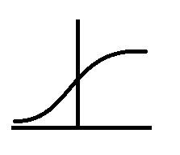
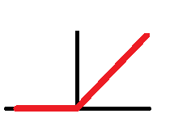

### **1.数据**

随着数据量的增加，传统机器学习算法的性能在初始的上升后进入平稳期，因为这些模型无法处理海量数据
而小型-大型的神经网络，其性能相比于传统机器学习有显著提升。
但是达到相应性能需要两个条件
- 训练一个规模足够大的神经网络，以发挥数据规模量巨大的优点
- 足够大的数据规模
---
在神经网络获得更好表现
- 训练规模足够大的神经网络
- 投入足够大的数据规模
---
在训练集规模不大时，神经网络与传统机器学习的性能之间并无显著区别。
最终结果取决于你的设计组件与算法细节

### **2.计算**
- GPU与CPU的进步
- 分布式计算

### **3.算法的创新**
由以前的采用 **SIGMOID** 算法训练转为采用 **ReLU** 算法
相比于Sigmoid算法，RelU算法很好的消除了梯度问题
- Sigmoid算法
  - 该算法存在两处梯度近乎为0的阶段，此时学习会变得十分缓慢
  

- 修正线性单元 ReLU算法
  - 对于所有正值输入，其梯度均为1，并与会u趋向于0
  
