###  源码已传Github


---
###  1.backward( ) Error 问题
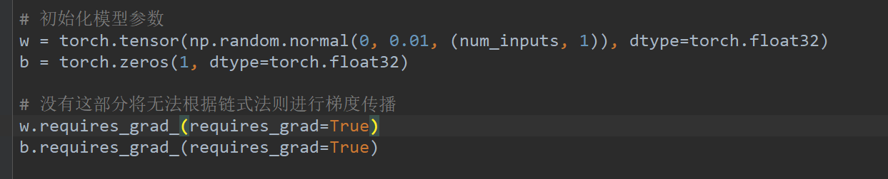

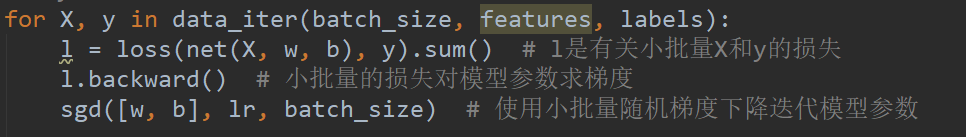

- 在初始化模型参数的过程中，一定要开启 <code>**requires_grad=True**</code>，否则会因为无法进行梯度传播，导致在训练模型时的<code>**l.backward()**</code>处出现Error。

---
###  2.关键词含义 

- **batch_size：** 批大小。在深度学习中，一般采用SGD训练，即每次训练在训练集中取batchsize个样本训练
- **epoch：** 1个epoch等于使用训练集中的全部样本训练一次，通俗的讲epoch的值就是整个数据集被轮几次
- **iteration：** 1个iteration等于使用batchsize个样本训练一次

---
###  3.常用函数与模块 

- **shuffle( ) 函数：** 将序列的所有元素随机排序
```
 import random #先引入random函数
 random.shuffle(list)
```

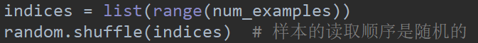

- **torch.nn模块**
  - 导入nn模块
 <code>**from torch import nn**</code>
 
  - 常继承<code>**nn.Module**</code>自定义自己的网络
  
 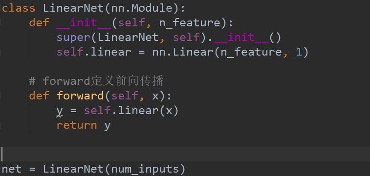

  - 也可通过<code>**nn.Sequential**</code>搭建网络（三种方式）

 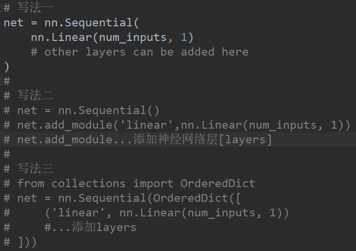
 ```
 print(net)      # 查看生成的全部神经网络
 print(net[0])   # 查看生成的第一层神经网络
 ```
 
 - 通过<code>**init**</code>模块初始化参数

 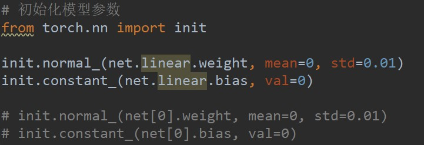
 
  - **注：**
    - 在使用自定义的<code>**LinearNet()**</code>搭建网络时，需要自定义<code>**LinearNet()**</code>内容，通过<code>**net=LinearNet()**</code>获取网络。并且在初始化模型参数时，通过<code>**net.linear.weight/bias**</code>初始化参数。
   
    - 若通过<code>**nn.Sequential**</code>搭建网络，则不必自定义<code>**LinearNet()**</code>,通过<code>**net[0].weight/bias**</code>初始化参数。

   
   
- **init 模块**
  - 如上图，Pytorch通过**init模块**进行参数初始化，PyTorch在**init模块**中提供了多种参数初始化方法。并且在**init模块**中，已经自动附加了梯度<code>**requires_grad=True**</code>，不用再手动添加。

  - **net.parameters( ) 函数**
 可用来查看模型所有的可学习参数
```
for param in net.parameters():
    print(param)
```

 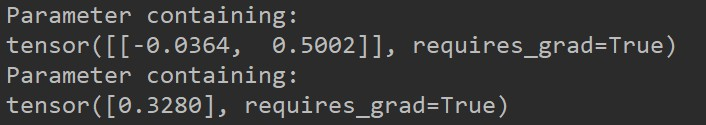

- **optim.SGD( )**
  - 指采用随机梯度下降算法进行优化。

---
### 4.获取学习到的参数与真实参数
 - 若采用自定义的<code>**LinearNet()**</code>搭建网络
```
dense = net.linear
print(true_w, dense.weight)
print(true_b, dense.bias)
```
 - 若通过<code>**nn.Sequential**</code>搭建网络
```
dense = net[0]
print(true_w, dense.weight)
print(true_b, dense.bias)
```

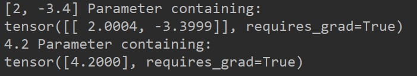

---

### 5.数据集
例如房价预测中，一个数据集被称为**训练集[training set]**，一栋房屋被称为一个**样本[sample]**，真实出售价格被称为**标签[label]**，用来预测标签的因素被叫做**特征[feature]**，**特征**用来表征样本特点。

---

### 6.错题总结

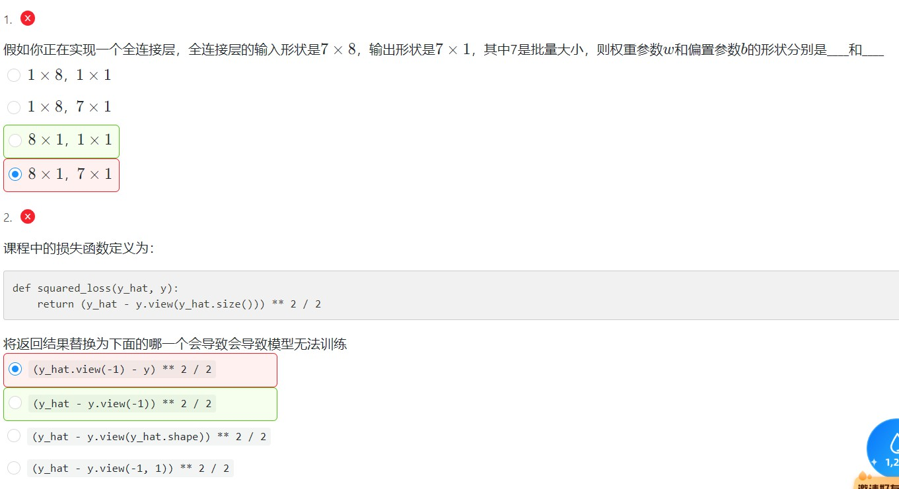
- 第一题

  - 批量：一次训练的样本个数
  - 权重参数W = 输入一维数组的大小 $\times$ 全连接层输出节点数
  - 偏置参数b = 全连接层输出节点数
 
 故因为输入形状为$7 \times 8$，输出形状为$7 \times 1$，$7$为批量大小
 所以输入一维数组的大小为$8$，输出节点数为$1$
 所以权重参数W = $8 \times 1$，偏置参数b = $1 \times 1$
 
官方解释：

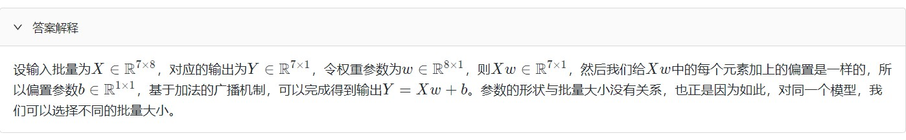

- 第二题

  - 原课程中损失函数要把$y$变形为$\hat{y}$的形状，保证输出的结果为$\hat{y}$的形状
 
 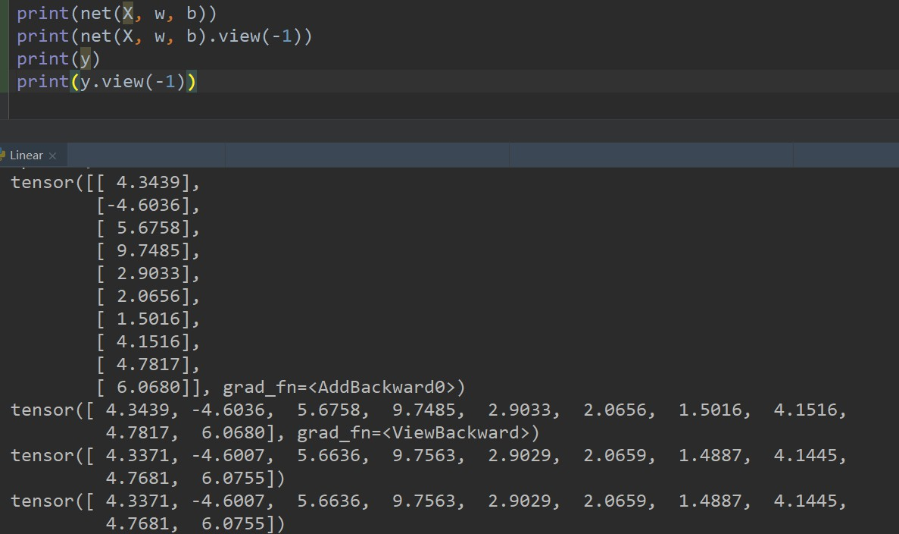
 
 而上图可见，当$\hat{y}$是一个二维张量时，**`y_hat.view(-1)`** 将其转化为一维张量。而 $y$ 本就是一个一维张量，此时 **`y.view(-1)`** 对$y$毫无影响。故综上而言，$y$ 作为一个一维张量，$\hat{y}$ 是一个二维张量。
  - 选项A `(y_hat.view(-1) - y) ** 2 / 2` 中已将`y_hat`与`y`转化为一个形状
  - 选项B `(y_hat - y.view(-1)) ** 2 / 2` 中`y_hat`与`y`的形状未发生变化
故选项B无法正常运行

官方解释：

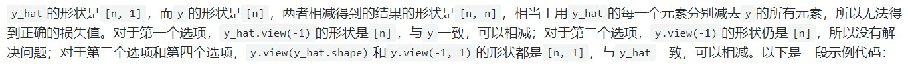

